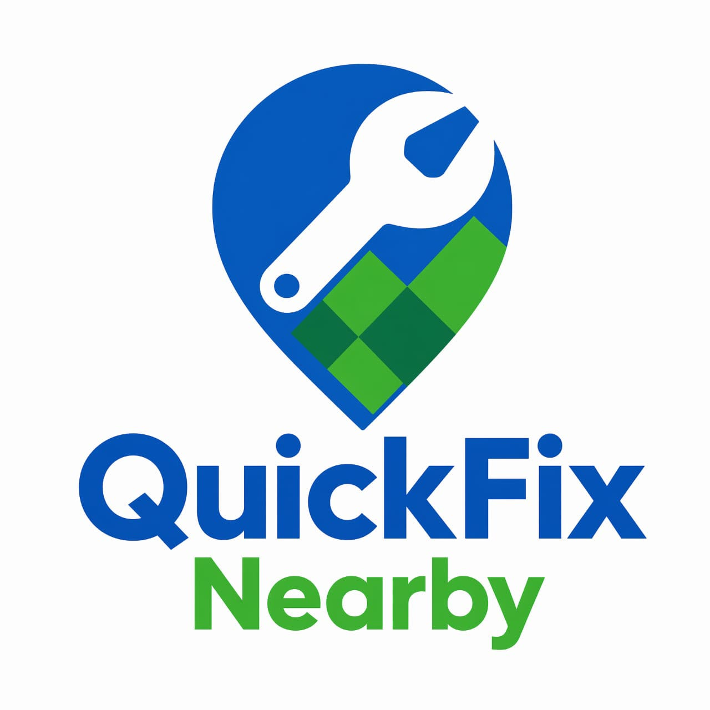

# QuickFix Nearby — Professional Service Marketplace



A marketplace platform connecting customers with verified, on-demand service professionals — electricians, plumbers, mechanics, builders, barbers, and more — across Nigeria.

**Status:** early MVP. The landing page, lead capture, email/password auth, and role-aware dashboards (customer/professional/admin) are live, backed by Postgres via SQLAlchemy + Flask-Migrate, with CSRF protection, rate limiting, and security headers in place. Booking/service-requests and OAuth are still ahead — see [`TODO.md`](TODO.md) for exactly what's built vs. planned.

## Overview

- **24/7 service booking** — customers request services anytime, specifying category, location, and urgency
- **Verified professionals** — pre-vetted providers with ratings, coverage areas, and identity verification
- **Live dashboard** — booking/service-request tracking for customers, professionals, and admins
- **Secure by default** — hashed credentials, CSRF-protected forms, rate-limited auth/lead endpoints, and a strict CSP

## Tech stack

| Layer | Technology |
|---|---|
| Backend | Python, Flask |
| Hosting / deploy | Vercel (serverless functions) |
| Database | Postgres (Neon-ready) via SQLAlchemy + Flask-Migrate — schema-managed, not yet pointed at a real Neon project |
| Media storage | Cloudinary — not yet integrated |
| AI / ML | Hugging Face Inference API — not yet integrated |
| Auth | Flask-Login (email/password, hashed) — live; Google OAuth not yet built |
| Frontend | HTML5, hand-rolled CSS (Tailwind migration planned) |

## Core features (planned)

1. **Customer booking** — location-based requests, category selection, urgency level, scheduling
2. **Professional management** — profiles, availability, coverage area, ratings, earnings, verification
3. **Admin controls** — lead review, provider approval, incident tracking, reporting

### Service categories

⚡ Electrician · 🚰 Plumber · 🚗 Mechanic · 🧱 Builder · 💈 Barber · and more

## Design & branding

**Logo:** a blue map pin combined with a wrench, with a green checkerboard accent — reads as *location + repair + speed*.

**Target color palette:**

| Color | Hex | Role |
|---|---|---|
| Primary Blue | `#0068B7` | Headers, navigation, buttons |
| Bright Blue | `#168BE0` | Branding, highlights, map elements |
| Primary Green | `#20A84A` | Booking, success, verification |
| Dark Green | `#168447` | Logo/text accents |
| White | `#FFFFFF` | Backgrounds, cards |
| Light Gray | `#F2F4F5` | Card/section backgrounds |
| Yellow/Gold | `#F5B51B` | Ratings, stars |
| Orange/Red | — | Map pins, urgency indicators |
| Dark Gray | `#263238` | Body text |

> ⚠️ **Not yet applied.** The live landing page currently uses a different placeholder palette (cream background, amber CTAs, forest green, brick red — see `app/static/css/style.css`). Restyling to the palette above is tracked in `TODO.md`, pending confirmation.

**UX direction:** mobile-first, rounded cards, soft shadows, large touch targets, map-centric discovery ("Find & Fix It Fast"), verification badges, real professional photography. Primary flow: **Search → Find nearby pro → View profile → Book → Pay → Track → Rate.**

## Data model

Implemented so far (Phase 2 in progress) — a unified `users` table plus a separate leads table; role-specific tables below are still planned:

- **users** *(live)* — id, name, email, password_hash, role (customer / professional / admin), service_category, verified, created_at, updated_at. `service_category`/`verified` are professional-only fields kept on this table for now rather than a separate `professionals` table.
- **contact_submissions** *(live)* — landing-page leads from `/leads`, shown on professional dashboards (filtered by category) and the admin dashboard (all leads)
- **customers** *(planned)* — id, user_id, phone, location
- **professionals** *(planned)* — id, user_id, service_type, verified, rating, total_jobs, coverage_area — will absorb `service_category`/`verified` off of `users`
- **service_requests** *(planned)* — id, customer_id, professional_id (nullable), service_type, description, location, urgency, status, created_at

Schema is managed by Flask-Migrate (Alembic) — see `migrations/`. Run `flask db upgrade` to apply.

## Project structure

```
Quick-Fix/
├── api/
│   └── index.py             # Vercel WSGI entrypoint
├── app/
│   ├── __init__.py           # Flask app factory
│   ├── extensions.py         # db, login_manager, migrate, csrf, limiter
│   ├── models.py             # User, ContactSubmission
│   ├── cli.py                # `flask create-admin`
│   ├── security.py           # response security headers (CSP, etc.)
│   ├── errors.py             # CSRF/rate-limit error handlers
│   ├── routes/
│   │   ├── main.py           # "/", "/healthz", "/leads"
│   │   ├── auth.py           # "/register", "/login", "/logout"
│   │   └── dashboard.py      # "/dashboard" (role-aware)
│   ├── static/
│   │   ├── css/style.css
│   │   └── logo.png
│   └── templates/
│       ├── index.html        # Marketing landing page
│       ├── base_app.html     # Shared shell for auth/dashboard pages
│       ├── _topbar.html
│       ├── auth/
│       └── dashboard/
├── migrations/                # Flask-Migrate/Alembic — `flask db upgrade`
├── requirements.txt
├── vercel.json
├── .env.example
├── .gitignore
├── run.py
├── README.md
└── TODO.md
```

## Getting started

### Requirements

- Python 3.11+
- (Later phases) a [Neon](https://neon.tech) Postgres database, a Cloudinary account, a Hugging Face API token, a Google OAuth client — see `.env.example`

### Local setup

```bash
git clone https://github.com/Simmyt3r/Quick-Fix.git
cd Quick-Fix
python -m venv venv
source venv/bin/activate  # Windows: venv\Scripts\activate
pip install -r requirements.txt
cp .env.example .env
flask db upgrade   # creates the schema — SQLite by default, or Postgres if DATABASE_URL is set
python run.py
```

Visit `http://localhost:5000`. To try the admin dashboard, create an admin from the CLI:

```bash
flask create-admin you@example.com yourpassword
```

> `.env.example` already lists the Cloudinary/Hugging Face/Google variables ahead of time, but only `SECRET_KEY`, `FLASK_ENV`, and `DATABASE_URL` are actually read by the code today — the rest activate as each phase in `TODO.md` lands.

## Deployment (Vercel)

1. Provision a [Neon](https://neon.tech) project and copy its connection string into `DATABASE_URL`.
2. Push to GitHub and import the repo into Vercel.
3. Add the environment variables from `.env` in the Vercel project settings (Production **and** Preview) as each becomes needed.
4. Run `flask db upgrade` against the production `DATABASE_URL` once, from a machine that can reach it — Vercel's serverless functions shouldn't run migrations on every cold start.
5. `vercel.json` already routes all requests to `api/index.py` — confirm static assets under `app/static/` serve correctly on a real deploy (tracked in `TODO.md`).
6. Deploy — Vercel builds the Python serverless function automatically.

## Security

- No secrets in code — every credential is read from an environment variable, no hardcoded fallback values
- Passwords are hashed with Werkzeug, never stored in plain text — live
- CSRF protection on every form (`/leads`, `/login`, `/register`) via Flask-WTF — live
- Rate limiting via Flask-Limiter — `/login` (10/min), `/register` (5/hr), `/leads` (10/hr) — live, but uses in-memory storage, so limits are per-process and won't hold across multiple serverless instances until a shared backend (e.g. Upstash Redis) is added
- Security headers on every response — CSP (no `unsafe-inline`), X-Frame-Options, X-Content-Type-Options, Referrer-Policy, and HSTS over HTTPS — live

## Support

- GitHub Issues: [Project Issues](https://github.com/Simmyt3r/Quick-Fix/issues)
- Email: support@quickfix.ng

## License

MIT License — see `LICENSE` file for details. *(Not yet added — see `TODO.md`.)*

---

**Founder:** Nicazz Ishor
**Built with ❤️ for Nigeria 🇳🇬**
